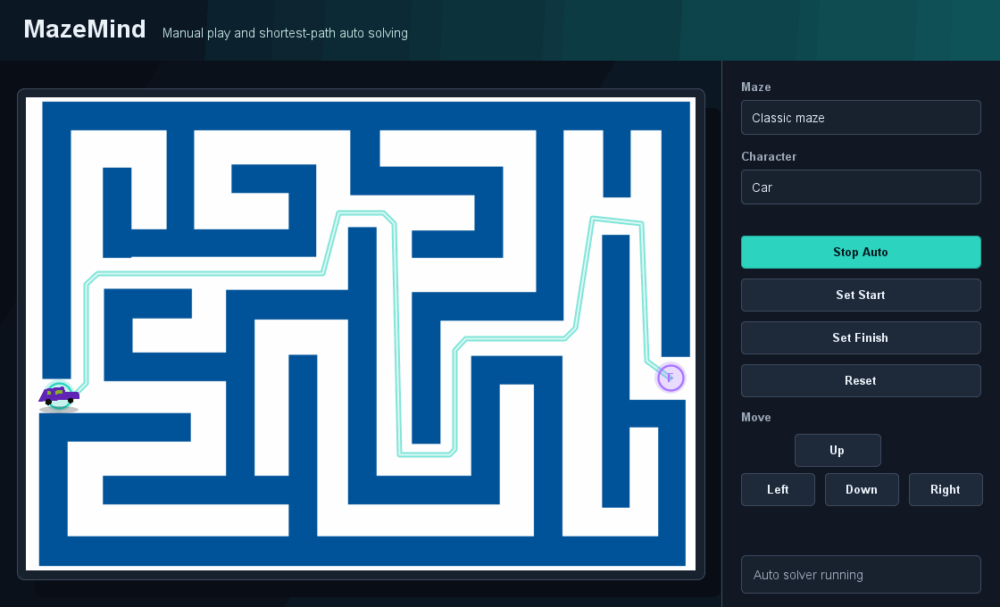
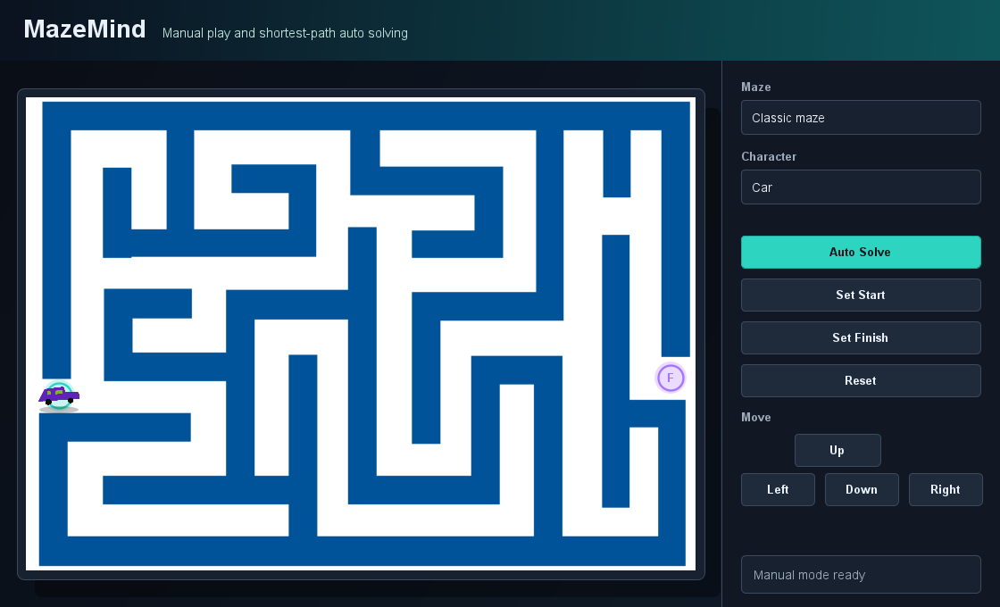
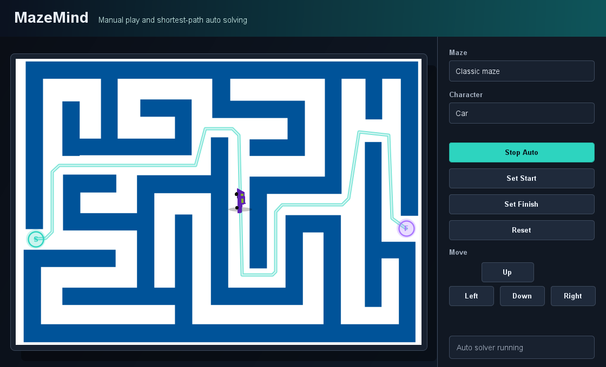

# MazeMind

MazeMind is a Java Swing maze app where players can solve image-based mazes manually or let the app find an efficient route automatically. It ships with two default mazes and two default characters, and it supports user-added maze and character images.

## Walkthrough



## Screenshots





## Features

- Add custom maze and character images from local files.
- Move manually with `WASD`, arrow keys, or on-screen controls.
- Prevent movement through walls using pixel-based collision checks.
- Set custom start and finish positions.
- Auto-solve with an A* shortest-path search, diagonal movement checks, and wall-safe path smoothing.
- Dark desktop UI with route preview, start and finish markers, and character rotation toward movement.

## Run

```powershell
.\run.ps1
```

## Test

```powershell
.\test.ps1
```
